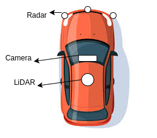

# 🚗 Self-Driving Car Perception System

This repository contains the perception stack for a self-driving vehicle using multiple sensors including **LiDAR**, **camera**, and **radar**. Built on **ROS**, it focuses on real-time detection and understanding of the driving environment.

---



## 📦 System Overview

The system integrates the following perception capabilities:

- **Line Detection** using a 16-channel **Velodyne LiDAR** with assisted line segmentation.
- **Traffic Light Detection** using an **Intel RGB camera**.
- **Traffic Sign Recognition** via the Intel camera.
- **Radar Fusion** using data from **3 radar sensors** to assist in dynamic object detection and tracking.

---

## 🧠 Perception Modules

### 1. Line Detection
- Uses 3D point cloud data from Velodyne LiDAR.
- Performs assisted segmentation for robust lane line detection in urban and highway environments.

### 2. Traffic Light Detection
- Real-time detection using RGB image input.
- Color and state recognition (Red / Yellow / Green).
- Machine learning enhancements optional for improved robustness.

### 3. Traffic Sign Recognition
- Classifies and localizes common traffic signs (e.g., Stop, Yield, Speed Limit).
- Pre-trained model integration or custom training supported.

### 4. Radar Integration
- Supports 3 radar sensors placed at different angles.
- Fuses object data with LiDAR and camera detections.
- Useful for detecting vehicles and obstacles in poor visibility.

---

## 🛠️ Technologies Used

- **ROS** (Robot Operating System)
- **Python / C++**
- **PCL** (Point Cloud Library)
- **OpenCV**
- **Sensor Drivers**:
  - Velodyne LiDAR (VLP-16)
  - Intel RealSense Camera
  - Automotive-grade Radars
- **Machine Learning Models** (optional): YOLO, SSD, etc.


## 🚀 Getting Started

### 1. Prerequisites

- ROS (Melodic / Noetic / Foxy)
- Velodyne and Intel RealSense drivers
- Dependencies: `PCL`, `OpenCV`, ROS packages like `cv_bridge`, `image_transport`

### 2. Installation

```bash
git clone https://github.com/enesdoruk/ros-self-driving-perception.git
mkdir build
cd build
catkin_make
source devel/setup.bash
```

### 2. Run The System

```bash
roslaunch perception_stack perception.launch
```
